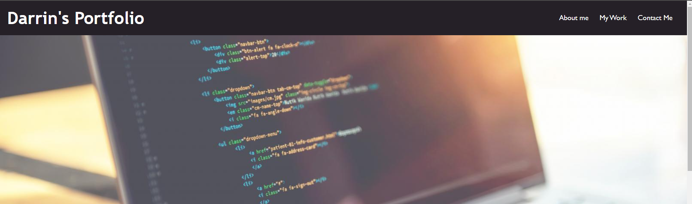
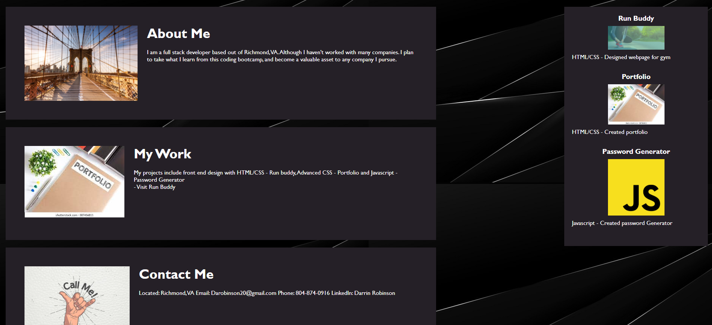

# Portfolio-
 
##Application Description
I've created a portfolio to display the projects I've done so far, and will continue to add/update as I complete other projects in the future. This Portfolio will grow, and be a proper representation of the skill set I've acquired through the bootcamp.

## Technology Used
HTML- semantic HTML
CSS 

## Link to Application 
git@github.com:Darobinson20/Portfolio-.git

## Screenshots

